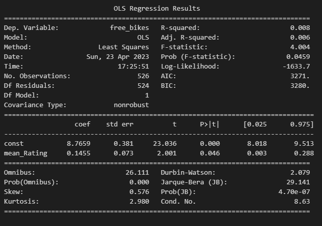

# Final-Project-Statistical-Modelling-with-Python

## Project/Goals

The main goal of this project is to review, analyze, visualize data from different APIs and build models

## Process
### Step 1. Connecting to CityBikes API and choose a city covered by the CityBikes API and retrieve all available bike stations in that city. I chose Toronto. 

In file **city_bikes.ipynb**

### Step 2. Connecting to Foursquare and Yelp APIs and for each of the bike stations query both APIs to retrieve information for the following in that location (Bares, and POI(categories,address,rating...)).

- Note: Before starting work with APIs (HTTP Method GET), you must log in to the pages and create authorization keys, which must then be added to the evairment variable system.

In file **yelp_foursquare_EDA.ipynb**

### Step 3. Joining Data for 3 API, visualization to explore the data and create SQLite database and store the data

In file**joining_data.ipynb**

### Step 4. Building a Model (regression and classification model)

In file **model_building.ipynb**

## Results
When I compare FSQ and Yelp API, I find FSQ much more intuitive to use for me.
There is a much larger selection of components that I can include in FSQ. Or it's just my impression because I spent much more time with the FSQ API and understood it better.

Simple Linear regression outputs:

R-squared is possibly the most important measurement produced by this summary. R-squared is the measurement of how much of the independent variable (Bar Rating) is explained by changes in our dependent variables (Free bikes). In percentage terms, 0.008 would mean our model explains 0.8%. It is too low. This model is not good fit.

Classification model outputs:

.PNG)

The log-likelihood of our model is -1633.7
Our goal is to find the parameter values that maximize the likelihood function, hence, the term “maximum likelihood”.
LL-Null output is same like the Log-Likelihood. 
LL p-value is 0.5272 that idicate that our model has a poor fit.
p>|z| show efect of each variable on the outcome. mean_Rating is begger then 0.05, that indicate that variable we should remove from model. 

## Challenges 
I encountered many challenges within the projects.
My biggest challenge is manipulating json, joining tables and understanding model outputs as well as visualizations.

## Future Goals
If I had more time, I would definitely spend more time to studying statistics, in order to better understand visualizations and model outputs.
